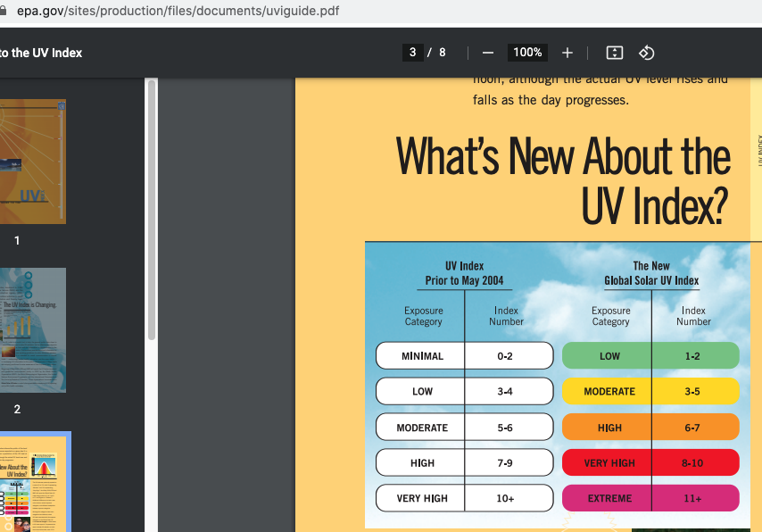
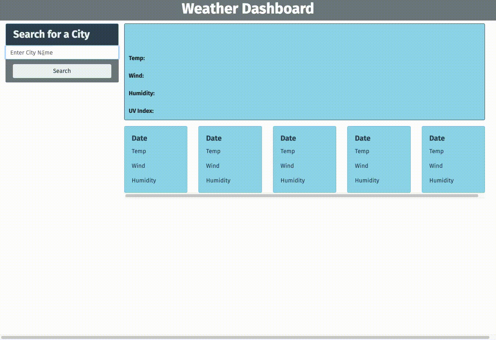

# Weather-Dashboard

## Description
This is a weather application that allows the user to search for weather conditions for a specific city by typing in a city name.  The current weather is displayed as well as the 5-day Forecast when the 'Search' button is clicked.  The data returned include temperature, windspeed, humidity, as well as the UV Index for the current day.  A corresponding icon is shown depending on the weather conditions.  The UV Index range also shows the corresponding color depending on the condition - low, moderate, high, very high or extreme. I used the UV Index range found in the EPA website to get the numbers as well as the corresponding colors for each range.

  

## Usage
For each time a user searches weather for a city, this city is saved as a button; when clicked, it will display the saved city's current weather and 5-Day Forecast.  An alert message is presented if the user typed a city that was not found.

## Language used
* `Javascript`
* `CSS`

# Mock Up

  

Link to deployed project: https://donnastjames.github.io/Weather-Dashboard/

## MIT License

&copy;2021 Donna Crawford

Permission is hereby granted, free of charge, to any person obtaining a copy of this software and associated documentation files (the "Software"), to deal in the Software without restriction, including without limitation the rights to use, copy, modify, merge, publish, distribute, sublicense, and/or sell copies of the Software, and to permit persons to whom the Software is furnished to do so, subject to the following conditions:

The above copyright notice and this permission notice shall be included in all copies or substantial portions of the Software.

THE SOFTWARE IS PROVIDED "AS IS", WITHOUT WARRANTY OF ANY KIND, EXPRESS OR IMPLIED, INCLUDING BUT NOT LIMITED TO THE WARRANTIES OF MERCHANTABILITY, FITNESS FOR A PARTICULAR PURPOSE AND NONINFRINGEMENT. IN NO EVENT SHALL THE AUTHORS OR COPYRIGHT HOLDERS BE LIABLE FOR ANY CLAIM, DAMAGES OR OTHER LIABILITY, WHETHER IN AN ACTION OF CONTRACT, TORT OR OTHERWISE, ARISING FROM, OUT OF OR IN CONNECTION WITH THE SOFTWARE OR THE USE OR OTHER DEALINGS IN THE SOFTWARE.

## Contributor

For questions, please contact:

- [Donna Crawford](https://github.com/Donnastjames)